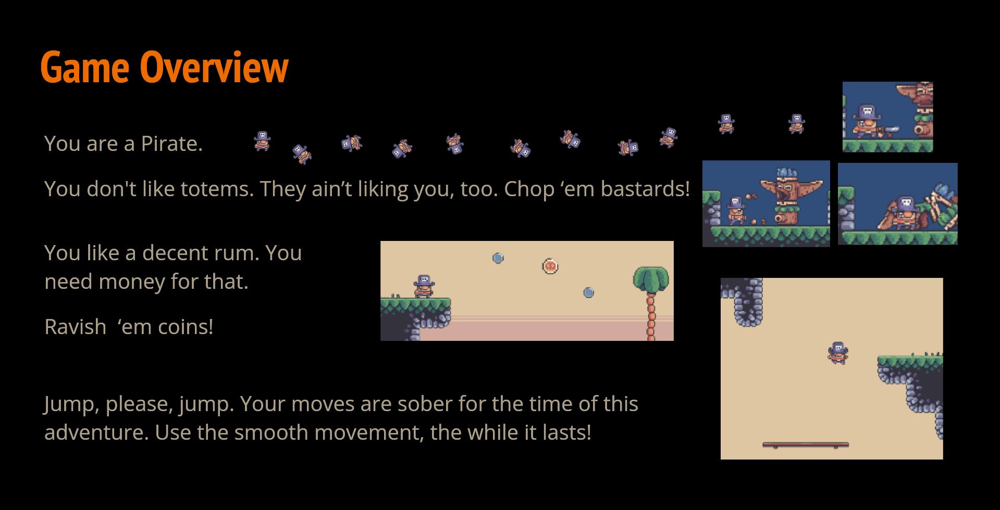
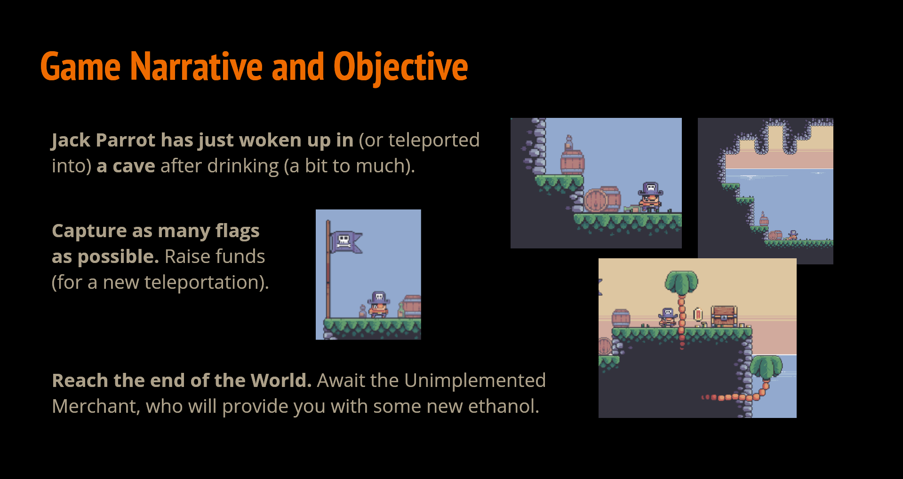

# Chopirate [TLDR: Click to play][hosted-game]




## Run the game

### In the browser

#### Play Online [[here]][hosted-game]
Some browsers might have significantly lower performance.

#### Host the game locally
1. Download repo and host ./docs subfolder
```shell
git clone git@github.com:Siiir/2025_11c_02_6week.git
cd 2025_11c_02_6week/docs
python -m http.server 8000
```
2. Go to http://localhost:8000 in your browser.

### Play on desktop
1. Download [release][gh-releases] for your device.
2. Unpack the archive and open the folder.
3. Run the executable file.  
   Named after the game/project. E.g. `Chopirate.exe`, `Chopirate.app`, `6week.exe`.

## Start contributing to the repo from scratch

### Clone this repository (shell + ssh)
```shell
git clone git@github.com:Siiir/2025_11c_02_6week.git
cd 2025_11c_02_6week
```

### Install git hooks

#### Windows (shell)
**Prerequisite:** Python 3 binary is installed and accessible as `python`.
```bat
python -m venv venv/
.\venv\Scripts\pip.exe install -r requirements.txt
.\venv\Scripts\pre-commit.exe install
.\venv\Scripts\pre-commit.exe install --hook-type commit-msg
```

#### Linux/macOS (shell)

**Prerequisite:** Python 3 binary is installed and accessible as `python3`.
```shell
python3 -m venv ./venv/
./venv/bin/pip install -r requirements.txt
./venv/bin/pre-commit install
./venv/bin/pre-commit install --hook-type commit-msg
```

## Contribution

### How to contribute?
1. Clone the repository  
1.1 git clone  
1.2 Install the hooks  
2. Create a feature branch
3. Make your changes
4. Ensure all pre-commit hooks pass
5. Submit a pull request

### Developer credits
[In separate file.](./CREDITS.md)

### University credits
Completion of a 6-week project within:  
the specialized area **eXtended Reality, Games and Immersive Systems**  
in the department of **eXtended Reality and Immersive Systems**  
at the **Polish-Japanese Academy of Information Technology.**

[hosted-game]: https://siiir.github.io/2025_11c_02_6week/
[gh-releases]: https://github.com/Siiir/2025_11c_02_6week/releases